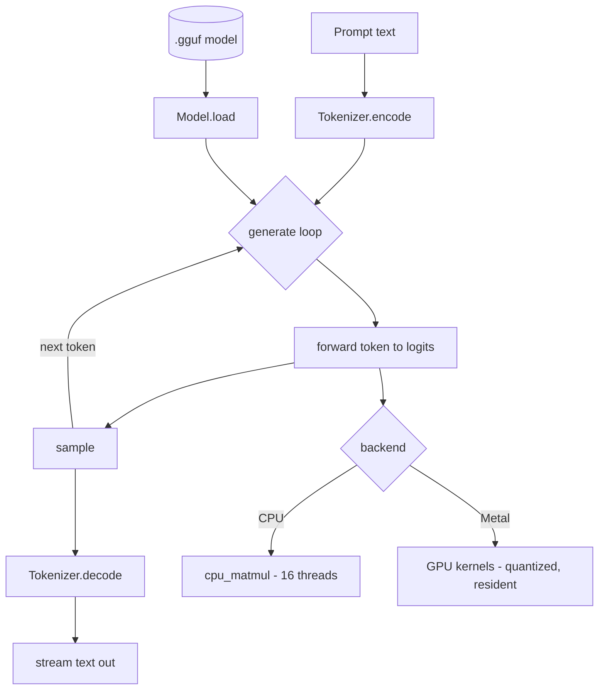

# HOS — Diagrams

## 1. Top level: file in, text out

```
        ┌─────────────┐        ┌───────────────────────────┐        ┌──────────┐
 model  │  .gguf file │        │            HOS            │  text  │  you /   │
 ─────▶ │ (weights,   │ ─────▶ │  (load · think · sample)  │ ─────▶ │  chat.py │
        │  tokenizer) │        │                           │        │          │
        └─────────────┘        └───────────────────────────┘        └──────────┘
              ▲                              │
         prompt text ───────────────────────┘
```

## 2. The pipeline (what happens to one request)

```
 prompt ─▶ Tokenizer.encode ─▶ [token ids] ─▶ Model.load (once)
                                                   │
            ┌──────────────────────────────────────┘
            ▼
   ┌─────────────────────────────────────────────────────────┐
   │  for each new token:  forward(token, position) ─▶ logits │
   │                                  │                       │
   │                          sample(logits) ─▶ next token id │
   │                                  │                       │
   │                       Tokenizer.decode ─▶ text piece ────┼─▶ stream out
   └──────────────────────────────────────────────────────────┘
            (repeat until EOS or max tokens)
```

## 3. Inside `forward()` — the two architectures

```
                         x = embedding[token]
                                 │
        ┌────────────────────────┴───────────────────────────┐
        │                  for each layer                      │
        │                                                      │
        │   ┌──── STANDARD TRANSFORMER (Llama/Mistral/Qwen2) ──┐│
        │   │  RMSNorm → Q,K,V → RoPE → Attention(KV cache)    ││
        │   │         → out-proj → (+ residual)                ││
        │   └──────────────────────────────────────────────────┘│
        │                       — or —                          │
        │   ┌──── QWEN3.5 HYBRID (per layer, 1 of 2 types) ───┐ │
        │   │  attention layer (every 4th): gated attention   │ │
        │   │     + QK-norm + partial RoPE                     │ │
        │   │  linear layer (the rest): in-proj → conv1d →     │ │
        │   │     L2-norm Q/K → gated delta-net (rolling state)│ │
        │   │     → gated RMSNorm → out-proj                   │ │
        │   └──────────────────────────────────────────────────┘│
        │                          │                            │
        │     RMSNorm → SwiGLU feed-forward → (+ residual)      │
        └───────────────────────────┬──────────────────────────┘
                                     ▼
                    RMSNorm → output projection ─▶ logits (one score per token)
```

## 4. Backends — where the math runs

```
   Weight (a matrix of numbers)
        │
        ├── CPU path ──▶ cpu_matmul()  ── 16 threads, f32        (forward.rs)
        │
        └── GPU path ──▶ Metal kernels ── thousands of cores,
                          weights kept compressed (quantized)
                          in unified memory                      (metal_be.rs)
                                 │
            ┌────────────────────┴─────────────────────┐
            │  GpuRunner (transformers)                 │
            │  Qwen35Gpu (hybrid): activations + KV/    │
            │  conv/state stay on GPU; one command      │
            │  buffer per token (no CPU round-trips)    │
            └────────────────────────────────────────────┘
```

## 5. Mermaid (renders on GitHub)


